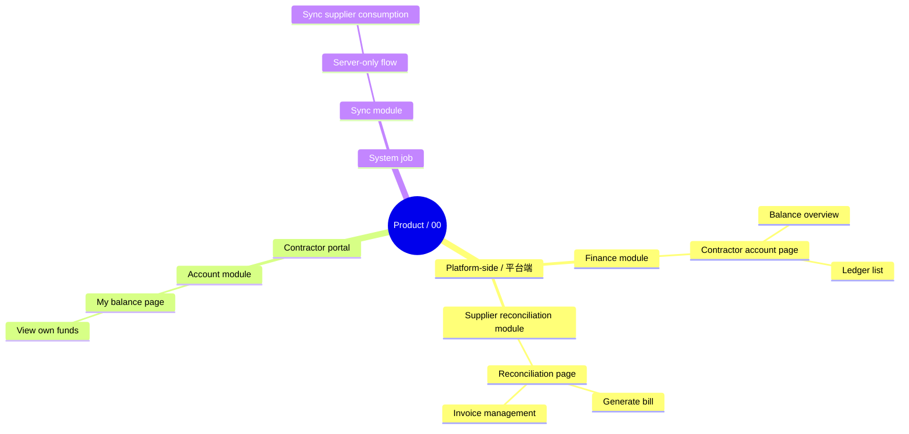

# Output Structure

Use this when writing the actual PRD or splitting multiple documents.

Apply `necessity-gate.md`: choose the smallest document structure that preserves business clarity, implementation decisions, testing criteria, UX constraints, and risk controls.

## Global vs Module Detail

For complex or multi-module PRDs, create one entrance document / front section:

`00_PRD总览_全局规则_主业务流程`

It contains:

- Plain-language business background, role glossary, and core concept dictionary.
- Business anchors / non-negotiable premises and change-control note.
- One-sentence business goal.
- Document/module index.
- Main file navigation map: 端 / module / page / function point information architecture.
- Main business flow.
- Core object relationship.
- Data flow and linkage map.
- Global rule index.
- Cross-module dependencies and writebacks.
- In-scope / out-of-scope index.
- High-risk must-read items.

It does not contain page-level detailed tables.

## Main File Navigation Map

The 00 主文件 needs a front-door information architecture so readers know where each function lives before module details. Use this for multi-module, multi-side, or B端后台 products.

Output a Mermaid `mindmap` or `flowchart` with four levels:

For each important node, add a compact note/table:

| 端 / Side | 模块 | 页面 / Page | 功能点 | Default Entry | Role | Permission | Data Scope | Cross-side Link |
|---|---|---|---|---|---|---|---|---|

Rules:

- The map explains where each function lives; it does not replace module details.
- Include page-level Tabs and server-only flows when they are real work carriers.
- Mark cross-side / 跨端 jumps, shared objects, and pages that can switch viewed subject.
- Keep detailed fields, button rules, and list Tab filters inside module/page docs.
- Put this before module details and before dense page specifications so users can orient themselves in 00.

## Global Rule Boundary

Global overview can say:

> All list Tabs must define business wording, data source, include/exclude conditions, mutual exclusivity, default sort, and must avoid technical conditions.

Global overview should not expand:

- 来账待认领 / 来账已认领 Tab details.
- Payment page Tab filters.
- Field lists.
- Button rules.
- Modal text.
- Interface fields.

Those belong in the specific module/page PRD.

## Full PRD Skeleton

Use this as a menu, not a quota. Omit or merge sections that add no decision, rule, acceptance criterion, or reader clarity.

1. Document info and confirmation record.
2. Business background, role glossary, business anchors, core concept dictionary, and plain-language flow.
3. Overview, global rule index, and main flow.
4. Background and goals.
5. Scope.
6. Users, roles, permissions, visibility.
7. User stories and scenario walkthroughs, using `references/user-stories-scenarios.md` when the product depends on real user context, activation, retention, or alternate paths.
8. Business flow.
9. Core objects, object flows, and state machines.
10. Data flow, source documents, writeback, linkage, and idempotency.
11. Feature details.
12. Exceptions and reverse flows.
13. Boundaries.
14. Interaction and UI states.
15. Data requirements.
16. Analytics.
17. Notifications, tasks, pushes, webhooks, and message preferences when events must reach another role or system.
18. Non-functional requirements as product decisions: performance target, SLA, data visibility latency, consistency, degradation, retry, security, backup, rate limit/abuse.
19. Release strategy.
20. Dependencies and risks.
21. Appendix.

## Reader-First Module Document

Specific module PRDs should start with a reader-first section, then place implementation details in the relevant page, action, or server-only flow.

Recommended module order:

1. Module purpose.
2. Main flow.
3. Page presentation.
4. Key operations.
5. Risks and exceptions.
6. Page implementation details.
7. Server-only automatic flows, if the module has background jobs, callbacks, sync, scheduled tasks, or compensation.
8. Notifications / tasks / webhooks, if module events must reach another role, user, or system.
9. Product-level non-functional requirements, if speed, reliability, consistency, degradation, or abuse control changes the user/business promise.
10. Module acceptance checklist.

The detailed page sections must include a Page Element Inventory Gate result, fields, data sources, status/writeback, permissions, idempotency, interaction behavior, and validation together. Avoid separate "field table / status table / permission table" sections when they force readers to jump around.

For a page, use:

| Page Area / Operation | User Goal | Why Shown / Decision Supported | Layout / Interaction | Fields | Data Source | Status / Writeback | Permission | Idempotency / Duplicate Handling | Error / Empty / Disabled | Feedback / Recovery | Acceptance |
|---|---|---|---|---|---|---|---|---|---|---|---|

Before or inside the table, include the page element inventory rather than only naming large regions. Cover page header, breadcrumb, status tag, primary action, summary cards, filters, search, sort, tabs, table columns, row actions, batch actions, pagination, import/export, detail drawer, modal/form, timeline, operation log, attachments, empty/loading/error/disabled/submitting/success states, permission/visibility, default value, data source, drilldown, and feedback/recovery.

For a server-only automatic flow, use:

| Automatic Flow | Trigger / Timing | Input Source | Processing Rule | Persisted Object | Status / Writeback | Idempotency / Retry | Failure / Compensation | Visibility / Log | Acceptance |
|---|---|---|---|---|---|---|---|---|---|

For notification or task flows, use:

| Event | Trigger Event | Receiver | Channel | Purpose | Content Variables | Deep Link | Dedupe / Throttle | Read/Unread / Task State | Recall / Update | User Preferences | Failure / Retry | Audit / Log |
|---|---|---|---|---|---|---|---|---|---|---|---|---|

For product-level non-functional requirements, use:

| Capability | Performance Target / SLA | Data Visibility Latency | Consistency Level | Idempotency / Retry | Degradation | Rate Limit / Abuse | Security / Privacy | Observability / Alert | Acceptance |
|---|---|---|---|---|---|---|---|---|---|

## Feature Detail Page Section

Each concrete page/module should include:

- Page purpose.
- Why this page exists, what the user sees first, and the primary path before listing fields.
- Page element inventory: every visible element, control, action entry, drawer/modal, state, and trace surface.
- Target端 / touchpoint and target user.
- Entry and permissions.
- Data source and authority.
- Data flow, linked objects, writeback, and downstream consumers.
- Visible information intent: why each key area/field/component is shown and what decision or action it supports.
- List fields.
- Search/filter/sort/page rules.
- Source data filter: source dataset, include/exclude conditions, source state, scope, period window, permission, availability, unavailable reason, snapshot, and refresh timing when data comes from outside the current page/object.
- Tab filter rules in business language.
- UX carrier and key components.
- Operations and state restrictions.
- Detail/drawer/modal behavior.
- Empty/loading/error/disabled states and feedback/recovery after each operation.
- Validation, disabled reasons, confirmation, recovery, audit trace.
- Exceptions and acceptance criteria.

Only expand a subsection when it changes behavior, implementation, testing, UX, risk, or operation.

## List Tab Filter Table

Keep this inside the relevant page/module:

| Page / Tab | Business Include Condition | Business Exclude Condition | Data Source | Default Sort | Mutually Exclusive? | Empty State |
|---|---|---|---|---|---|---|

No SQL, code enum, or database field conditions in PRD正文.
